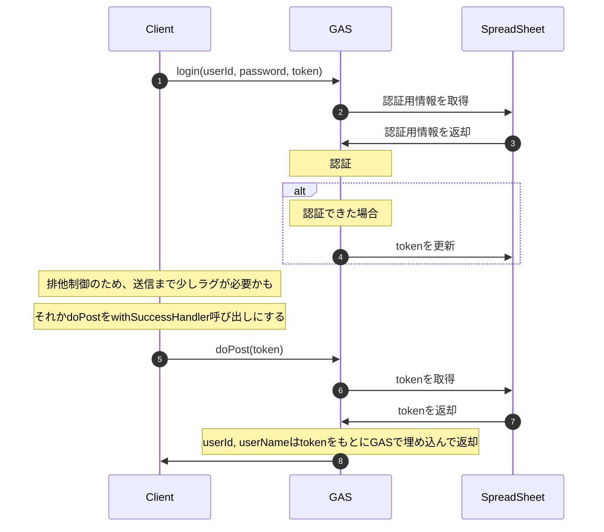

# GAS認証システムフロー図
## ログインフロー

```mermaid
sequenceDiagram autoNumber
Client ->> GAS: login(userId, password, token)
GAS ->> SpreadSheet: 認証用情報を取得
SpreadSheet ->> GAS: 認証用情報を返却
Note over GAS: 認証
alt
Note over GAS: 認証できた場合
GAS ->> SpreadSheet: tokenを更新
end
Note over Client: 排他制御のため、送信まで少しラグが必要かも
Note over Client: それかdoPostをwithSuccessHandler呼び出しにする
Client ->> GAS: doPost(token)
GAS ->> SpreadSheet: tokenを取得
SpreadSheet ->> GAS: tokenを返却
Note over GAS: userId, userNameはtokenをもとにGASで埋め込んで返却
GAS ->> Client: 
```

メモ：どうせwithSuccessHandler使うならサーバで生成して返してそのoutputを使えば良さそう